<p align="center">
  
</p>

# 🧬 ARIA — Agente de Raciocínio e Inteligência em Análise Clínica

> Plataforma de inteligência de dados e agentes de IA aplicada à saúde oncológica.


---

## 🌐 Demo Online

🔗 https://clinical-wisdom-web.lovable.app

> Ambiente demonstrativo do projeto ARIA utilizando arquitetura Medallion, agentes autônomos de IA e disponibilização de dados em tempo real.

---

## 🎯 Sobre o Projeto

O **Projeto ARIA** é uma plataforma de inteligência de dados desenvolvida pela **Agient** para transformar a operação de centros oncológicos brasileiros através de Engenharia de Dados moderna, IA Generativa e arquitetura escalável.

A maioria dos hospitais e clínicas no Brasil possui dados valiosos espalhados em planilhas, sistemas legados e arquivos isolados — sem estrutura, sem governança e sem inteligência operacional. O resultado: decisões lentas, desperdício de recursos e baixa capacidade analítica.

O ARIA resolve esse problema utilizando arquitetura Medallion, agentes especializados de IA e disponibilização inteligente de dados para transformar dados brutos em inteligência clínica, operacional e estratégica.

O projeto foi desenvolvido para demonstrar como pequenas equipes podem construir soluções enterprise utilizando uma stack acessível, moderna e de baixo custo operacional.

---

## 🏥 Contexto — Cliente Fictício

**Instituto Oncológico** — centro oncológico de médio porte com 3 unidades, 80 médicos e mais de 500 atendimentos/dia.

### Desafios identificados

- Dados clínicos, financeiros e operacionais em silos isolados
- Ausência de indicadores em tempo real
- Baixa rastreabilidade e auditoria de processos
- Dificuldade de tomada de decisão baseada em dados
- Falta de inteligência operacional para estoque e financeiro
- Dependência de análises manuais

### O que o ARIA entrega

- Centralização e governança dos dados institucionais
- Inteligência operacional e clínica em tempo real
- Análises automatizadas com agentes de IA
- Disponibilização estratégica de KPIs e métricas
- Controle inteligente de estoque e financeiro
- Base escalável para evolução contínua da operação

---

## 🏗️ Arquitetura da Solução

O ARIA utiliza uma arquitetura moderna baseada em Data Lakehouse, arquitetura Medallion e agentes autônomos de IA para transformar dados clínicos, financeiros e operacionais em inteligência estratégica em tempo real.

<p align="center">
  
</p>

## 🔄 Fluxo da Solução

1. Ingestão de dados brutos via arquivos CSV
2. Processamento no Databricks utilizando arquitetura Medallion
3. Transformações e validações com Python e PySpark
4. Consolidação da camada Gold
5. Disponibilização via Supabase/PostgreSQL
6. Consumo de dados via FastAPI
7. Integração com agentes autônomos de IA
8. Geração de insights clínicos, operacionais e estratégicos
9. Consumo via dashboards e aplicações web

> 💡 Projeto desenvolvido utilizando tecnologias gratuitas e open-source, demonstrando como pequenas equipes podem construir soluções enterprise escaláveis utilizando Engenharia de Dados + IA Generativa.

---

## 🤖 Agentes ARIA — Skills e Controle de Acesso

O ARIA é composto por agentes especializados com responsabilidades específicas e controle de acesso baseado em perfil de usuário.

### 🩺 Agente Clínico de Quadro do Paciente

> 🔒 Acesso restrito: Médicos autorizados

- Resumo clínico completo do paciente
- Evolução por estadiamento
- Identificação de padrões clínicos
- Alertas e pontos de atenção
- Relatórios estruturados por consulta
- Suporte à decisão médica baseado em IA

---

### 📊 Agente de Indicadores de Atendimento

> 👥 Acesso: Gestão operacional

- Análise de volume de atendimentos
- Identificação de gargalos
- Performance médica e operacional
- Alertas de metas não atingidas
- Sugestões de melhoria operacional

---

### 💰 Agente Financeiro

> 👥 Acesso: Diretoria e financeiro

- Monitoramento financeiro em tempo real
- Detecção de anomalias
- Projeções e tendências
- Análise de inadimplência
- Alertas financeiros inteligentes

---

### 📦 Agente de Estoque

> 👥 Acesso: Farmácia e suprimentos

- Monitoramento de estoque mínimo
- Alertas de validade
- Sugestões automáticas de reposição
- Análise de consumo
- Relatórios de criticidade

---

### 🧭 Agente Estratégico

> 👥 Acesso: Liderança executiva

- Cruzamento de dados clínicos e operacionais
- Insights estratégicos automatizados
- Recomendações priorizadas
- Relatórios executivos inteligentes
- Identificação de oportunidades de melhoria

---

## 🛠️ Stack Tecnológica

| Camada | Tecnologia | Função |
|---|---|---|
| Processamento | Databricks Community | Pipeline Medallion |
| Linguagem | Python + PySpark | Transformações e engenharia |
| IA Agents | LangChain + CrewAI | Orquestração de agentes |
| LLM Runtime | Groq API + Claude API | Inferência e raciocínio |
| API | FastAPI | Disponibilização de dados |
| Banco de Dados | Supabase (PostgreSQL) | Camada Gold |
| Deploy | Render.com | Hospedagem da API |
| Versionamento | Git + GitHub | Controle de código |
| IDE | VS Code | Desenvolvimento |

---

## 📁 Estrutura do Repositório

```bash
agient-aria-health/
│
├── data/
├── databricks/
│   ├── bronze/
│   ├── silver/
│   └── gold/
│
├── agents/
├── supabase/
├── docs/
├── api/
├── requirements.txt
└── README.md
```

---

## 🚀 Roadmap do Projeto

- [x] Arquitetura Medallion
- [x] Pipeline Bronze
- [x] Pipeline Silver
- [x] Pipeline Gold
- [x] Integração Supabase
- [x] API FastAPI
- [x] Deploy no Render
- [x] Agente Clínico
- [ ] Agente Financeiro
- [ ] Agente Estratégico
- [ ] Controle de acesso RBAC
- [ ] Dashboard operacional
- [ ] Observabilidade e monitoramento

---

## 💡 Método ARIA

O **ARIA** não é apenas um projeto — é um método replicável desenvolvido pela **Agient** para transformar dados em inteligência em diferentes setores.

### Próximos setores

- 🌱 Agronegócio
- 💰 Financeiro
- 🍽️ Alimentício
- ⚡ Energia

---

## 👨‍💻 Autor

**Vitor Marinho**  
Engenheiro de Dados | AI Engineer | Fundador da Agient

[](https://www.linkedin.com/in/vitor-marinho/)
[](https://github.com/VitorSMarinho)

🔗 LinkedIn: https://www.linkedin.com/in/vitor-marinho/  
🔗 GitHub: https://github.com/VitorSMarinho

---

> *"Com as ferramentas certas e o problema certo, pequenas equipes mudam setores inteiros."*  
> — Agient
