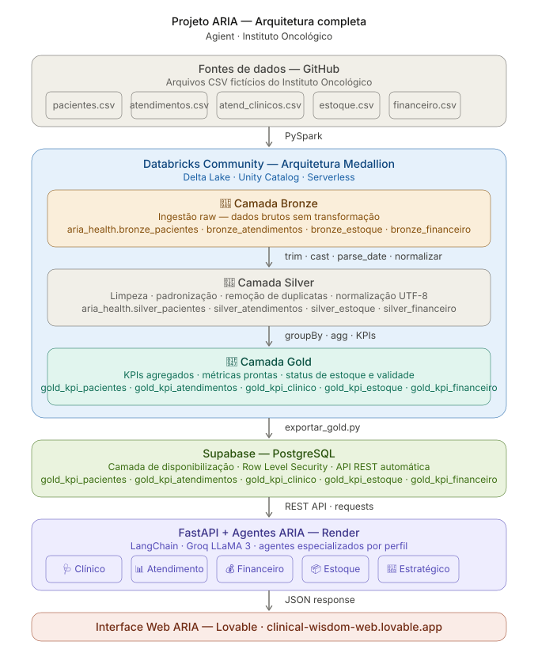

# 🧬 ARIA: Agente de Raciocínio e Inteligência em Análise Clínica

> Plataforma de inteligência de dados e agentes de IA aplicada à saúde oncológica.


---

## 🌐 Demo Online

🔗 https://clinical-wisdom-web.lovable.app

> Ambiente demonstrativo do projeto ARIA utilizando arquitetura Medallion, agentes autônomos de IA e disponibilização de dados em tempo real.

---

## 🎯 Sobre o Projeto

O **Projeto ARIA** é uma plataforma de inteligência de dados desenvolvida pela **Agient** para transformar a operação de centros oncológicos brasileiros através de Engenharia de Dados moderna, IA Generativa e arquitetura escalável.

A maioria dos hospitais e clínicas no Brasil possui dados valiosos espalhados em planilhas, sistemas legados e arquivos isolados, sem estrutura, sem governança e sem inteligência operacional. O resultado: decisões lentas, desperdício de recursos e baixa capacidade analítica.

O ARIA resolve esse problema utilizando arquitetura Medallion, agentes especializados de IA e disponibilização inteligente de dados para transformar dados brutos em inteligência clínica, operacional e estratégica.

O projeto foi desenvolvido para demonstrar como pequenas equipes podem construir soluções enterprise utilizando uma stack acessível, moderna e de baixo custo operacional.

---

## 🏥 Contexto: Cliente Fictício

**Instituto Oncológico**: centro oncológico de médio porte com 3 unidades, 80 médicos e mais de 500 atendimentos/dia.

### Desafios identificados

- Dados clínicos, financeiros e operacionais em silos isolados
- Ausência de indicadores em tempo real
- Baixa rastreabilidade e auditoria de processos
- Dificuldade de tomada de decisão baseada em dados
- Falta de inteligência operacional para estoque e financeiro
- Dependência de análises manuais

### O que o ARIA entrega

- Centralização e governança dos dados institucionais
- Inteligência operacional e clínica em tempo real
- Análises automatizadas com agentes de IA
- Disponibilização estratégica de KPIs e métricas
- Controle inteligente de estoque e financeiro
- Base escalável para evolução contínua da operação

---

## 🏗️ Arquitetura da Solução

O ARIA utiliza uma arquitetura moderna baseada em Data Lakehouse, arquitetura Medallion e agentes autônomos de IA para transformar dados clínicos, financeiros e operacionais em inteligência estratégica em tempo real.

<p align="center">
  
</p>

## 🔄 Fluxo da Solução

1. Ingestão de dados brutos via arquivos CSV
2. Processamento no Databricks utilizando arquitetura Medallion
3. Transformações e validações com Python e PySpark
4. Consolidação da camada Gold
5. Disponibilização via Supabase/PostgreSQL (KPIs) + Supabase pgvector (base de conhecimento)
6. Consumo de dados e RAG via FastAPI
7. Agente decide, por pergunta, quais tools chamar (KPI e/ou busca semântica)
8. Geração de insights clínicos, operacionais e estratégicos, com resposta rastreada (tokens/latência/custo)
9. Consumo via dashboards e aplicações web

> 💡 Projeto desenvolvido utilizando tecnologias gratuitas e open-source, demonstrando como pequenas equipes podem construir soluções enterprise escaláveis utilizando Engenharia de Dados + IA Generativa.

---

## 🤖 Agentes ARIA: Skills e Controle de Acesso

O ARIA é composto por agentes especializados com responsabilidades específicas e controle de acesso baseado em perfil de usuário.

### 🩺 Agente Clínico de Quadro do Paciente

> 🔒 Acesso restrito: Médicos autorizados

- Resumo clínico completo do paciente
- Evolução por estadiamento
- Identificação de padrões clínicos
- Alertas e pontos de atenção
- Relatórios estruturados por consulta
- Suporte à decisão médica baseado em IA

---

### 📊 Agente de Indicadores de Atendimento

> 👥 Acesso: Gestão operacional

- Análise de volume de atendimentos
- Identificação de gargalos
- Performance médica e operacional
- Alertas de metas não atingidas
- Sugestões de melhoria operacional

---

### 💰 Agente Financeiro

> 👥 Acesso: Diretoria e financeiro

- Monitoramento financeiro em tempo real
- Detecção de anomalias
- Projeções e tendências
- Análise de inadimplência
- Alertas financeiros inteligentes

---

### 📦 Agente de Estoque

> 👥 Acesso: Farmácia e suprimentos

- Monitoramento de estoque mínimo
- Alertas de validade
- Sugestões automáticas de reposição
- Análise de consumo
- Relatórios de criticidade

---

### 🧭 Agente Estratégico

> 👥 Acesso: Liderança executiva

- Cruzamento de dados clínicos e operacionais
- Insights estratégicos automatizados
- Recomendações priorizadas
- Relatórios executivos inteligentes
- Identificação de oportunidades de melhoria

---

## 🧠 Camada de AI Engineering

A partir da v2.0, o ARIA deixou de ser um LLM com dados colados no prompt e
passou a seguir o pipeline padrão de um agente de produção, mapeado direto
no [roadmap.sh/ai-engineer](https://roadmap.sh/ai-engineer):

| Etapa do roadmap | Implementação no ARIA |
|---|---|
| **LLM APIs** | Groq (`openai/gpt-oss-120b`) via LangChain, com troca de modelo por env var |
| **Embeddings** | `fastembed` local (ONNX, sem chave de API), modelo multilíngue PT-BR |
| **Vector DB** | Supabase/pgvector em produção; store local em JSON pra dev/CI/eval |
| **RAG** | chunking → embedding → retrieval semântico (`aria/retriever.py`) sobre protocolos/políticas internas |
| **Function/Tool Calling** | o agente decide, por pergunta, se busca KPI (`buscar_kpis`) ou faz RAG (`buscar_protocolo_clinico`), sem mais prompt-stuffing |
| **AI Agents** | 5 agentes especializados (`aria/agents.py`), cada um com system prompt, escopo e papel de acesso próprios, todos sobre o mesmo loop de tool-calling |
| **Evaluation** | `eval/run_evals.py`: evals determinísticos (tool certa + keyword na resposta) + eval opcional baseado em modelo (LLM como juiz) |
| **Observability** | `aria/observability.py`: traço de cada chamada (tokens, latência, custo estimado, tools usadas) em JSONL local e, opcionalmente, na tabela `agent_traces` do Supabase |
| **AI Safety** | respostas sempre com disclaimer de suporte à decisão; dados fictícios; tools com enum fechado de tabelas (sem SQL livre) |

> Setup: `python scripts/ingest_knowledge_base.py` popula a base de RAG,
> `python eval/run_evals.py` roda a suíte de evals contra o agente real.

## 🛠️ Stack Tecnológica

| Camada | Tecnologia | Função |
|---|---|---|
| Processamento | Databricks Community | Pipeline Medallion |
| Linguagem | Python + PySpark | Transformações e engenharia |
| LLM Runtime | Groq API (`openai/gpt-oss-120b`) | Inferência e raciocínio |
| Orquestração / Tool Calling | LangChain (`bind_tools`) | Function calling real, sem framework pesado |
| Embeddings | fastembed (local, ONNX) | Vetorização multilíngue sem custo de API |
| Vector DB | Supabase pgvector | Base de conhecimento (RAG) |
| Evals | Suite própria (determinístico + LLM-as-judge) | Regressão e qualidade das respostas |
| Observabilidade | JSONL + tabela `agent_traces` (Supabase) | Tokens, latência, custo, tools usadas |
| API | FastAPI | Disponibilização de dados e agentes |
| Banco de Dados | Supabase (PostgreSQL) | Camada Gold + Vector DB |
| Deploy | Render.com | Hospedagem da API |
| Versionamento | Git + GitHub | Controle de código |
| IDE | VS Code | Desenvolvimento |

---

## 📁 Estrutura do Repositório

```bash
agient-aria-health/
│
├── data/
├── databricks/
│   ├── bronze/
│   ├── silver/
│   └── gold/
│
├── aria/                  # núcleo de AI Engineering: LLM, RAG, tools, agentes, observabilidade
├── knowledge_base/        # documentos fonte do RAG (protocolos/políticas fictícios)
├── scripts/
│   └── ingest_knowledge_base.py
├── eval/                  # suíte de evals (determinístico + LLM-as-judge)
├── agents/                # scripts de demonstração standalone
├── supabase/              # SQL versionado (pgvector, RPCs, observabilidade)
├── docs/
├── frontend/
├── api.py
├── requirements.txt
└── README.md
```

---

## 🚀 Roadmap do Projeto

- [x] Arquitetura Medallion
- [x] Pipeline Bronze
- [x] Pipeline Silver
- [x] Pipeline Gold
- [x] Integração Supabase
- [x] API FastAPI
- [x] Deploy no Render
- [x] Agente Clínico
- [x] Agente Financeiro
- [x] Agente Estratégico
- [x] RAG com vector DB (Supabase pgvector + fallback local)
- [x] Function/Tool calling real (sem prompt-stuffing)
- [x] Suíte de evals (determinístico + LLM-as-judge)
- [x] Observabilidade (tokens, latência, custo, tools usadas)
- [ ] Controle de acesso RBAC (hoje o papel é só descritivo no prompt de cada agente)
- [ ] Dashboard operacional
- [ ] MCP Server (expor KPIs/RAG do ARIA como ferramentas pro Claude Desktop/Code)

---

## 💡 Método ARIA

O **ARIA** não é apenas um projeto: é um método replicável desenvolvido pela **Agient** para transformar dados em inteligência em diferentes setores.

### Próximos setores

- 🌱 Agronegócio
- 💰 Financeiro
- 🍽️ Alimentício
- ⚡ Energia

---

## 👨‍💻 Autor

**Vitor Marinho**  
Engenheiro de Dados | AI Engineer | Fundador da Agient

[](https://www.linkedin.com/in/vitor-marinho/)
[](https://github.com/VitorSMarinho)

🔗 LinkedIn: https://www.linkedin.com/in/vitor-marinho/  
🔗 GitHub: https://github.com/VitorSMarinho

---

> *"Com as ferramentas certas e o problema certo, pequenas equipes mudam setores inteiros."*  
> Agient
