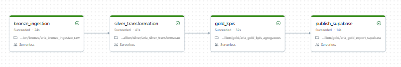
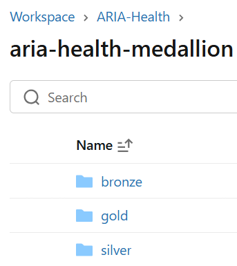

# ⚙️ Pipeline Workflow — ARIA

Documentação técnica da orquestração de dados utilizando Databricks Workflows.

---

# 🔄 Fluxo Automatizado

O pipeline é dividido em 4 etapas:

1. 🥉 Bronze Ingestion
2. 🥈 Silver Transformation
3. 🥇 Gold KPI Generation
4. ✅ Gold Validation Layer

---

# 🚀 Execução do Workflow

  

---

# ✅ Execução Concluída

  

---

# 🛠️ Recursos Implementados

- Arquitetura Medallion
- Apache Spark
- Databricks Workflows
- Unity Catalog
- Data Lineage
- Validação de qualidade
- Orquestração automática
- Processamento distribuído

---

# 📊 Estrutura das Camadas

  

🏠 Documentação Databricks | [Voltar para Databricks Architecture](../README.md)
