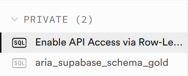

# 🗄️ Supabase — Gold Data Delivery Layer

O Supabase é utilizado no projeto ARIA como camada de disponibilização dos dados analíticos processados na arquitetura Medallion.

A camada Gold é consumida pela aplicação ARIA através da FastAPI, garantindo acesso estruturado, seguro e escalável aos KPIs clínicos, operacionais e financeiros.

---

# 🔐 API Access via Row-Level Security (RLS)

O projeto utiliza políticas de segurança via Row-Level Security (RLS) para controle de acesso aos dados disponibilizados pelas APIs REST do Supabase.

  
   
  <em>Enable API Access via Row-Level Security</em>

---

# ⚙️ Recursos Implementados

- Supabase REST API
- PostgreSQL como camada analítica
- Row-Level Security (RLS)
- Disponibilização da camada Gold
- Integração com FastAPI
- APIs consumidas pelos agentes ARIA
- Estrutura pronta para dashboards e aplicações

---
